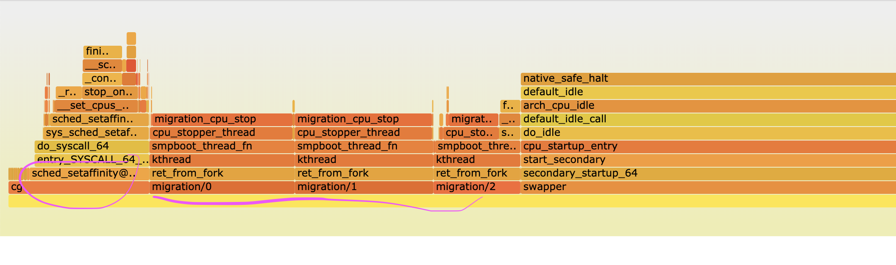

## chicken-gun 

> A **chicken gun** is a large-diameter, compressed-air cannon used to fire dead chickens at aircraft components in order to simulate high-speed bird strikes during the aircraft's flight. (source: [*Wikipedia*](https://en.wikipedia.org/wiki/Chicken_gun))

Here you can find `cg`, a tool aimed at providing very targetted load at specific parts of a machine to verify:

- what happens when specific problematic scenarios occur, and
- if we're properly collecting telemetry from our systems.

```
chicken-gun 0.1.0
Throwing chickens into the system

USAGE:
    cg [OPTIONS] <SUBCOMMAND>

FLAGS:
    -h, --help       Prints help information
    -V, --version    Prints version information

OPTIONS:
    -p, --pid <pid>    File to write the PID of the current execution to [default: /tmp/cg.pid]

SUBCOMMANDS:
    context-switches    Drive context switches to the top
    cpu                 Drive user cpu utilization to the top
    help                Prints this message or the help of the given subcommand(s)
    memory              Tries to allocate a lot of memory
    memory-wave         Keeps allocating and deallocating memory in intervals
```

### In a container

Just like in a regular bare-metal or virtual machine, `cg` can run in containerized environments too.

A container image can be found on DockerHub: [cirocosta/chicken-gun](https://hub.docker.com/r/cirocosta/chicken-gun).

```sh
docker run cirocosta/chicken-gun cpu --threads 4
```

### Scenarios

#### `context-switches`

In this scenario, threads get their execution swapped in `n` cores all the time, constantly.

As a result, we end up with:

- not much userspace CPU consumption,
- very high per-task context switch numbers, and
- high kernel-space CPU utilization for `migration/*` processes.

For instance, looking at the results of sampling a mostly idle system that only has `cg context-switches` running for `30s`:



```sh
# take samples of the whole callgraph 99 times a second for every
# cpu in the machine while running the `sleep` command.
#
#    -F,--freq        Profile at this frequency.
#
#    -a,--all-cpus    System-wide collection from all CPUs 
#                     (default if no target is specified).
#
#    -g               Enables call-graph (stack chain/backtrace) recording.
#
perf record --freq 99 -a -g sleep 30


# `perf-script` reads perf.data (created by perf record) and displays 
# trace output.
#
# With the traces generated by `perf script`, `stackcollapse` then 
# collapses that multiline output of samples into semicolon-separated single
# lines, appropriate for `flamegraph.pl` to consume.
#
# From those collapsed stack traces, `flamegraph.pl` generates the
# `svg` with the flamegraph visualization.
perf script | \
	stackcollapse-perf.pl | \
	flamegraph.pl --hash --width=1000 > \
	context-switches-flamegraph.svg
```

Now, looking at the number of context switches as reported by `procfs`, we can see how aggressive we are in terms of context switching:

```sh
cd /proc/$(cat /tmp/cg.pid)/tasks
find . -name "status" | xargs -n1 grep 'ctxt'
voluntary_ctxt_switches:	4
nonvoluntary_ctxt_switches:	1
voluntary_ctxt_switches:	214
nonvoluntary_ctxt_switches:	1590249
voluntary_ctxt_switches:	232
nonvoluntary_ctxt_switches:	1590307
voluntary_ctxt_switches:	240
nonvoluntary_ctxt_switches:	1590386
voluntary_ctxt_switches:	242
nonvoluntary_ctxt_switches:	1590412
```

Now, if we focus on one of those threads, an track on which CPU they've been running at the moment that


### LICENSE

MIT - See [`./LICENSE`](./license).

